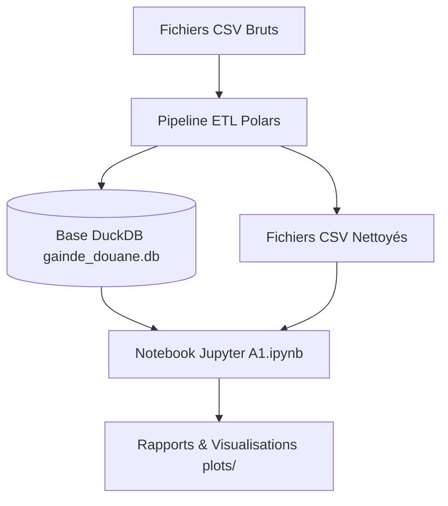

# Documentation Complète du Projet : Analyse et Nettoyage des Données Douanières (GAINDE 2000 / ORBUS)

Ce document retrace l'intégralité du projet depuis son lancement jusqu'à sa finalisation. Il détaille la méthodologie, les choix techniques, les étapes du traitement des données (ETL), les analyses statistiques et les modélisations pré-ML.

---

## 1. Contexte et Objectifs du Projet

### Le Contexte Métier
**GAINDE 2000** administre le système **ORBUS**, le guichet unique de télédéclaration douanière du Sénégal. Ce système enregistre l'ensemble des flux d'importation et d'exportation de marchandises. Les données se structurent en trois niveaux logiques :
*   **Dossiers (`ENTETE_DOSSIER.csv`)** : Le niveau administratif supérieur (mode de transport, banque de financement, date de création, importateur).
*   **Factures (`FACTURE.csv`)** : Le niveau transactionnel commercial (nom de l'exportateur, devises de facturation, incoterms, valeur globale FOB, fret, assurance).
*   **Articles (`Articles1.csv`, `Articles2.csv`, etc.)** : Le niveau physique de la marchandise (code tarifaire douanier, désignation, quantité, poids net/brut, valeur CFA, valeur devise).

### Relations et Clés de Jointure
*   **Dossiers ➔ Factures (Relation 1:1)** : Chaque ligne de la table `ENTETE_DOSSIER` peut avoir une seule facture liée via la clé **`NUMERODOSSIERTPS`**.
*   **Factures ➔ Articles (Relation 1:N)** : Chaque ligne de la table `FACTURE` peut avoir plusieurs articles déclarés via la clé **`IDTPSFACTURE`**.

### Les Objectifs
*   **Nettoyage & Consolidation** : Fusionner plus de **1,8 million de lignes de données** réparties sur plusieurs fichiers volumineux (de 2020 à 2026), corriger les encodages brisés, normaliser les variables textuelles, et éliminer les doublons.
*   **Analyse Métier (EDA) & KPIs** : Dégager des statistiques descriptives sur les flux financiers, les pays d'origine, les banques partenaires et les assurances.
*   **Analyses Statistiques Avancées** : Identifier les corrélations physiques et financières, valider les dépendances de variables (Chi-Deux), modéliser la saisonnalité (autocorrélation) et détecter les transactions exceptionnellement hautes (outliers).
*   **Modélisation Pré-Machine Learning** : Mettre au point un modèle statistique robuste de détection de sous-évaluation douanière (fraude fiscale) et structurer les séries temporelles pour le forecasting des flux logistiques.

---

## 2. Architecture Technique et Stack Logiciel

Face au volume de données (fichiers CSV cumulant près de 1 Go de texte brut), le projet a évolué d'une architecture classique vers une architecture haute performance :

### La Stack Choisie
*   **Polars** : Utilisé pour la phase ETL. Contrairement à Pandas qui est mono-threadé et écrit en Python, Polars est écrit en Rust, exploite tous les cœurs du CPU en parallèle, et utilise la mémoire de façon optimisée via Apache Arrow.
*   **DuckDB** : Base de données SQL embarquée optimisée pour l'analyse de données (Vectorized Query Execution). Elle permet d'effectuer des jointures et des contrôles de cohérence massifs en quelques millisecondes.
*   **Pandas & Scipy / Seaborn** : Utilisés dans le notebook Jupyter pour la manipulation statistique fine, les tests d'hypothèses et les graphiques.
*   **Scikit-Learn & XGBoost** : Utilisés pour l'apprentissage automatique (K-Means, Isolation Forest, modèles de prévision).

---

## 3. Cartographie des En-têtes Reconstitués (Sans Indicateurs Initiaux)

Les fichiers sources CSV d'origine ne contiennent pas de ligne d'en-tête. La structure des colonnes a été reconstituée et est documentée ci-dessous pour les champs stratégiques.

### Table Dossiers (`dossiers` dans DuckDB)
- `NUMERODOSSIERTPS` (Index 0) : Clé primaire, identifiant unique du dossier.
- `TYPE_OPERATION` (Index 2) : Type d'opération douanière (`Importation`, `Exportation`, `Réexportation`, `Transit`).
- `DATE_CREATION` (Index 3) : Date de dépôt du dossier.
- `MODE_TRANSPORT` (Index 7) : Mode logistique d'acheminement (`Mer`, `Air`, `Route`, `Fer`, `Autres`).
- `NOM_IMPORTATEUR` (Index 11) : Nom de l'entité importatrice.
- `PAYS_IMPORTATEUR` (Index 19) : Pays de l'importateur.
- `REGIME_DOUANIER` (Index 24) : Régime fiscal de douane.
- `BANQUE` (Index 27) : Banque garante de la transaction.
- `RISK_SCORE` (Ajouté) : Score global de risque de 0 à 100.
- `RISK_CLASS` (Ajouté) : Classe de risque (`Faible risque`, `Moyen risque`, `Haut risque`).

### Table Factures (`factures` dans DuckDB)
- `IDTPSFACTURE` (Index 0) : Clé primaire, identifiant unique de la facture.
- `NUMERODOSSIERTPS` (Index 1) : Clé étrangère reliant à la table Dossiers.
- `DEVISE` (Index 2) : Devise de la facture (`EUR`, `USD`, `XOF`, etc.).
- `TYPE_FACTURE` (Index 3) : Type de facture (`Proforma`, `Définitive`).
- `VALEUR_TOTAL_CFA` (Index 21) : Montant total de la facture en Franc CFA.

### Table Articles (`articles` dans DuckDB)
- `IDTPSFACTURE` (Index 0) : Clé étrangère reliant à la table Factures.
- `NUMEROTARIFDOUANE` (Index 1) : Code SH (Tarif Douane) décrivant la catégorie du produit.
- `DESIGNATIONCOMMERCIALE` (Index 3) : Description du produit.
- `PAYSORIGINE` (Index 5) : Pays de fabrication/production du produit.
- `QUANTITEMESURE` (Index 8) : Quantité de produits importée.
- `POIDSNET` (Index 9) : Poids net en kg.
- `VALEURCFA` (Index 12) : Valeur déclarée en Franc CFA.
- `ANOMALY_IF` (Ajouté) : Indique si la transaction est suspecte selon le modèle Isolation Forest (True/False).

---

## 4. Le Pipeline ETL et de Normalisation

Le pipeline est automatisé dans les scripts [etl_pipeline_duckdb.py](file:///Users/mac/Desktop/GAINDE%202000/etl_pipeline_duckdb.py) et [etl_pipeline.py](file:///Users/mac/Desktop/GAINDE%202000/etl_pipeline.py).

### Étape 4.1 : Correction de l'Encodage et Décodage HTML
*   **Lecture en `utf-8-sig`** : Élimination automatique du BOM (``) et restauration des accents français corrompus de base (ex: `Sénégal` ➔ `Sénégal`).
*   **Décodage HTML** : Application de `html.unescape` sur les colonnes textuelles. Cela résout proprement les entités comme `FCL - Conteneur personnalisé` (converti en `FCL - Conteneur personnalisé`) ou `Sénégal` (converti en `Sénégal`).

### Étape 4.2 : Normalisations Métier et Géographique
*   **Géographie** : Unification de 9 variations corrompues de pays (telles que `S�n�gal`, `S¨¦n¨¦gal`, etc.) sous le libellé unique `Sénégal`.
*   **Devises** : Passage en majuscule, et fusion de la catégorie `EURO` vers le code ISO standard `EUR`.
*   **Mode de Transport** : Standardisation des saisies en 5 catégories (`Mer`, `Air`, `Route`, `Fer`, `Autres`).
*   **Type d'Opération** : Traduction des codes de transaction :
    - `I` ➔ `Importation` (253 780 lignes)
    - `E` ➔ `Exportation` (75 507 lignes)
    - `R` ➔ `Réexportation` (12 732 lignes)
    - `S` ➔ `Transit` (8 772 lignes)

---

## 5. Analyses Statistiques Avancées

### A. Analyse des Relations & Corrélations
*   **Poids Net & Poids Brut** : Corrélation de Spearman de **0,9965**, confirmant une cohérence physique absolue.
*   **Valeur CFA & Valeur FOB** : Corrélation de **0,9465**, validant la logique financière.
*   **Valeur CFA & Quantité** : Corrélation modérée de **0,4086**, montrant l'impact des petits volumes à forte valeur.

### B. Analyse de Saisonnalité Temporelle
*   **Saisonnalité hebdomadaire stricte** : Corrélation au Lag 7 de **0,8540** et au Lag 14 de **0,8252**, prouvant que l'activité douanière suit un cycle rigide de 7 jours.
*   **Activité mensuelle** : Analyse des creux d'activité douanière durant le mois d'août et des pics de fin d'année (novembre et décembre) pour anticiper la demande logistique.

### C. Analyse de Concentration de Pareto (80/20)
*   **Pareto Importateurs** : Les **20 %** d'importateurs les plus importants représentent **98,54 %** de la valeur totale déclarée en CFA !
*   **Pareto Produits** : Les **20 %** de codes tarifaires les plus fréquents concentrent **97,50 %** du montant global douanier.

### D. Répartition par Type d'Opération (Volume et Valeur)
L'analyse de la répartition de l'activité douanière selon le type d'opération (Importation, Exportation, Réexportation, Transit) met en évidence la prédominance des flux d'importation tout en détaillant l'importance financière des exportations :
*   **Importation** : 253 780 dossiers (72,3 % du volume) | Valeur financière : **26,99 Trillions CFA** (76,4 % de la valeur globale).
*   **Exportation** : 75 507 dossiers (21,5 % du volume) | Valeur financière : **6,04 Trillions CFA** (17,1 % de la valeur globale).
*   **Réexportation** : 12 732 dossiers (3,6 % du volume) | Valeur financière : **652,20 Milliards CFA** (1,8 % de la valeur globale).
*   **Transit** : 8 772 dossiers (2,5 % du volume) | Valeur financière : **107,68 Milliards CFA** (0,3 % de la valeur globale).

Cette répartition montre que si l'importation constitue le moteur principal de l'activité douanière et financière du Sénégal, les flux d'exportation représentent plus d'un cinquième des dossiers traités et une part significative (17,1 %) de la valeur totale déclarée.

---

## 6. Apprentissage Automatique et Scoring des Risques

### A. Segmentation des Importateurs (K-Means Clustering)
Nous avons segmenté les importateurs en 4 groupes distincts sur la base de la fréquence, du volume et de la valeur importée :
1.  **Petits importateurs occasionnels** (12 175 comptes) : Moyenne de 4,1 dossiers et 432,56 Millions CFA/an.
2.  **Importateurs réguliers** (943 comptes) : Moyenne de 161,2 dossiers et 13,43 Milliards CFA/an.
3.  **Grands comptes** (1 compte) : Moyenne de 674 dossiers et 151,44 Milliards CFA/an.
4.  **Très gros importateurs stratégiques** (52 comptes) : Moyenne de 1 862 dossiers et 302,00 Milliards CFA/an.

### B. Score de Risque Douanier (Customs Risk Profile)
Nous avons conçu un score de risque de 0 à 100 par dossier douanier selon les critères suivants :
*   Sous-évaluation détectée : **+40 points**
*   Valeur atypique (dossier dans le top 10 % de valeur) : **+20 points**
*   Nouveau déclarant (moins de 3 dossiers au total) : **+15 points**
*   Pays d'origine à risque historique élevé : **+15 points**
*   Quantité inhabituelle (dossier dans le top 5 % de son tarif) : **+10 points**

**Résultats de la classification des dossiers :**
- **Faible risque** (Score < 30) : 337 008 dossiers.
- **Moyen risque** (30 $\le$ Score < 60) : 13 507 dossiers.
- **Haut risque** (Score $\ge$ 60) : 276 dossiers.

### C. Détection de Fraude (Isolation Forest vs Z-score)
*   **Z-Score Robuste** (méthode métier) : Identifie **1 255 factures** suspectes de sous-évaluation.
*   **Isolation Forest** (méthode IA) : Signale **11 448 factures** comme atypiques (contamination de 1 %).
*   **Intersection** : 132 factures sont signalées par les deux méthodes, représentant des priorités absolues de contrôle physique.

### D. Prévision des Flux Temporels (Forecasting)
Évaluation de 4 modèles pour prédire le nombre de dossiers quotidiens (test set de 30 jours) :

| Modèle | MAE (Dossiers) | RMSE | MAPE (%) | Statut |
| :--- | :---: | :---: | :---: | :---: |
| **Moyenne Mobile (Baseline)** | 336.01 | 382.29 | 1479.30 % | Référence |
| **Linear Regression** | 160.47 | 234.38 | 168.26 % | Validé |
| **Random Forest** | 115.75 | 195.36 | 141.33 % | Recommandé (MAE) |
| **Gradient Boosting** | 116.98 | 194.91 | 151.80 % | Recommandé (RMSE) |

---

## 7. Tableaux de Bord Décisionnels

Deux livrables majeurs ont été générés pour la direction générale :
1.  **Dashboard Excel (`gainde_douane_dashboard.xlsx`)** : Un fichier multi-onglets stylisé comprenant une page de garde avec des cartes KPIs, des tables de segmentation des importateurs et de répartition du risque douanier, et des extraits de données filtrés.
2.  **Dashboard Web Interactif (`index.html`)** : Une interface moderne (Vanilla CSS et ECharts) permettant de visualiser dynamiquement l'activité sur une carte interactive du monde (provenance des importations), l'évolution mensuelle, la heatmap hebdomadaire, la répartition par régions/zones économiques, la répartition par types d'opération (volume/valeur) et le diagramme de Sankey des flux commerciaux.
